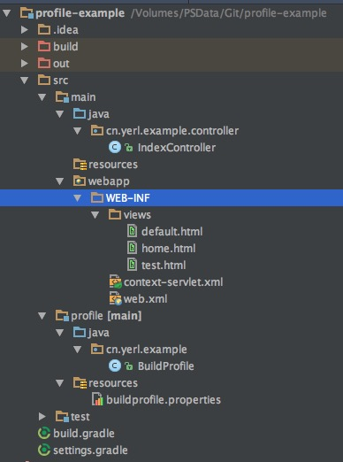

# Gradle Plugins

## Profile plugin
　　Profile plugin用于解决Java Web开发中的多环境、多现场配置难题。Profile plugin使用起来比较简单，如下面的例子：

```groovy
buildscript {
    repositories {
        mavenCentral()
    }

    dependencies {
        classpath 'cn.yerl.gradle:profile-plugin:1.0.0'
    }
}

// 多现场配置
apply plugin: 'profile'

profile {
    // 切换环境，使用home
    flavor 'test'
    // BuildProfile类的包名
    classPackage 'cn.yerl.example'
    // buildprofile.properties的文件名
    propertiesFileName 'buildprofile'

    // 默认配置
    defaultProfile {
        // 正式环境的数据库配置
        propertyField 'jdbc.driver', 'oracle.jdbc.driver.OracleDriver'
        propertyField 'jdbc.url', 'jdbc:oracle:thin:@10.0.1.3:1521:orcl'
        propertyField 'jdbc.username', 'db'
        propertyField 'jdbc.password', 'xxxxxxxx'
        propertyField 'jdbc.initialSize', '2'
        propertyField 'jdbc.maxActive', '2'
        
        classField 'String', 'INDEX_FILE', '"default"'

        propertyField 'hello', 'Hello From Default'
    }
    home {
        // 家里的数据库配置
        propertyField 'jdbc.url', 'jdbc:oracle:thin:@192.168.0.112:1521:orcl'
        propertyField 'jdbc.username', 'home_db'
        propertyField 'jdbc.password', 'home'
        
        classField 'String', 'INDEX_FILE', '"home"'

        // 在家里开发用mac，路径采用mac的路径写法
        propertyField "hello", 'Hello From Home'
    }
    test {
        // 测试环境的数据库配置
        propertyField 'jdbc.username', 'test_db'
        propertyField 'jdbc.password', 'test'
        
        // 测试环境的路径在D盘
        classField 'String', 'INDEX_FILE', '"test"'
        propertyField 'hello', 'Hello From Test'
    }
}
```

- propertyField: 写入配置到buildprofile.properties文件
- classField: 写入配置到BuildProfile类
- flavor: 切换环境, 如果没有写, 则默认是defaultProfile
- defaultProfile: 默认配置
- home/test: 演示的环境配置, 如果想修改或新增其它的配置, 可以随意起名字, 格式按着home/test写就行了。
- classPackage: 生成的BuildProfile类的package
- propertiesFileName: 生成的buildprofile.properties文件名


　　使用插件后，项目的目录会发生改变，新增profile目录：



　　同时，profile目录里会根据flavor配置而生成类（BuildProfile）和properties（buildprofile.properties），在main目录中，可以之间引用这两个文件。

```java
@Controller
public class IndexController {
    @GetMapping("/index")
    public ModelAndView index() throws IOException {
        // 使用Properties类读取buildprofile.properties的配置
        Properties properties = new Properties();
        InputStream profileFileStream = Thread.currentThread().getContextClassLoader().getResourceAsStream("buildprofile.properties");
        properties.load(profileFileStream);

        Map<String, Object> model = new HashMap<>();
        model.put("hello", properties.get("hello"));

        // 直接使用BuildProfile类就可以了
        return new ModelAndView(BuildProfile.INDEX_FILE, model);
    }
}
```
　　Spring里面经常在context里面配置数据库连接等，那么可以像下面这样配合Profile plugin做多现场配置。

```xml
<?xml version="1.0" encoding="UTF-8"?>
<beans xmlns="http://www.springframework.org/schema/beans"
       xmlns:xsi="http://www.w3.org/2001/XMLSchema-instance"
       xmlns:tx="http://www.springframework.org/schema/tx"
       xsi:schemaLocation="
        http://www.springframework.org/schema/beans
        http://www.springframework.org/schema/beans/spring-beans.xsd
        http://www.springframework.org/schema/tx
        http://www.springframework.org/schema/tx/spring-tx.xsd">

    <!-- spring的属性加载器，加载properties文件中的属性 -->
    <bean id="placeholderConfigurer" class="org.springframework.beans.factory.config.PropertyPlaceholderConfigurer">
        <property name="location">
            <value>classpath:buildprofile.properties</value>
        </property>
        <property name="fileEncoding" value="utf-8" />
    </bean>
    <bean id="dataSource" class="com.alibaba.druid.pool.DruidDataSource"
          destroy-method="close">
        <property name="driverClassName">
            <value>${jdbc.driver}</value>
        </property>
        <property name="url">
            <value>${jdbc.url}</value>
        </property>
        <property name="username">
            <value>${jdbc.username}</value>
        </property>
        <property name="password">
            <value>${jdbc.password}</value>
        </property>
        <property name="initialSize">
            <value>${jdbc.initialSize}</value>
        </property>
        <property name="maxActive">
            <value>${jdbc.maxActive}</value>
        </property>
    </bean>
    <!-- 省略以下的配置 -->
    ....
</beans>
```